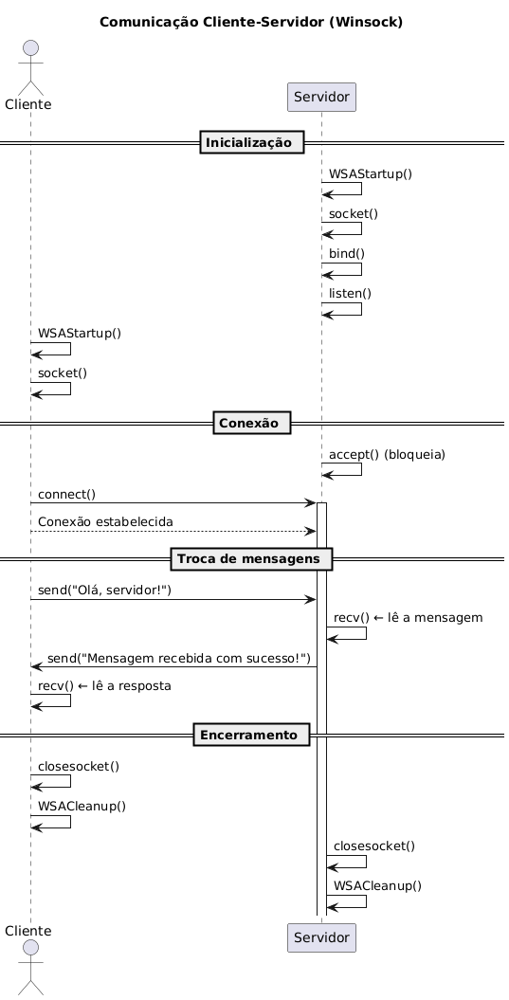

# Projeto Cliente-Servidor em C++

Este projeto demonstra uma comunicação básica entre um **servidor** e um **cliente** implementados em **C++** usando **sockets**. O objetivo é didático: entender o funcionamento da troca de mensagens entre duas aplicações em rede.

---

## Estrutura do Projeto

